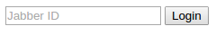
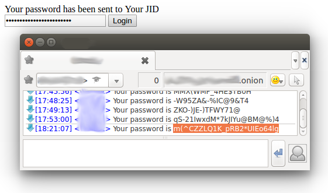
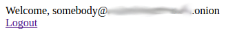

# XmppWebAuth

This subproject demostrate how to have web authorization without keeping password into database.

* [login.php](login.php) - sample login page
* [page.php](page.php) - protected page, which show different content for anonymous/authrized users
* [logout.php](logout.php) - logout page

**Require runned XmppRedis !**

## Authorization scheme for Web Site without keeping password into database

This project allow build authrization scheme for Your site without keeping password into DB:

* Customer of Your site enter his jabber JID on Web-form.

* Script receive JID, generate random password, store pair JID/password at user-session and send password to Customer's JID. When I say "user-session", I dont mean 'cookies'.

* Customer receive password and enter him on Web-form.

* Script receive password from Web-form and check with session-stored password.
* In case when password is right, Your Customer ID (login) is entered JID.

So, nobody can steal your passwords database.

Also, in this case, target for bruteforce attacks will be Customer's jabber service instead Your Site.
